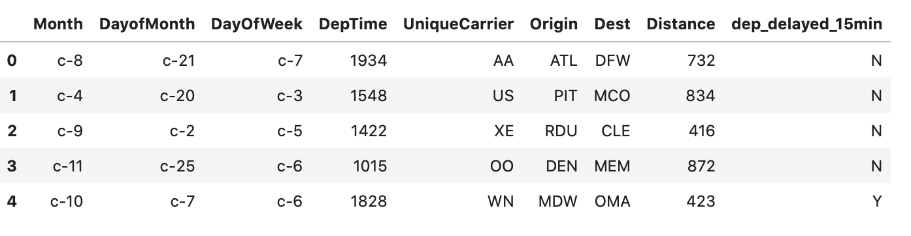
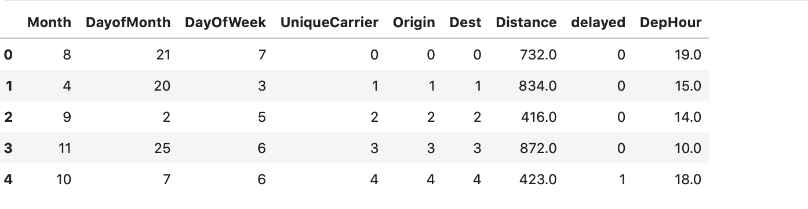
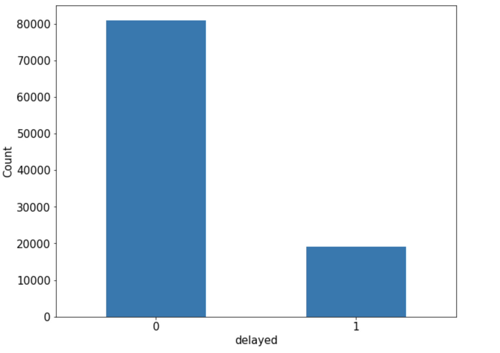
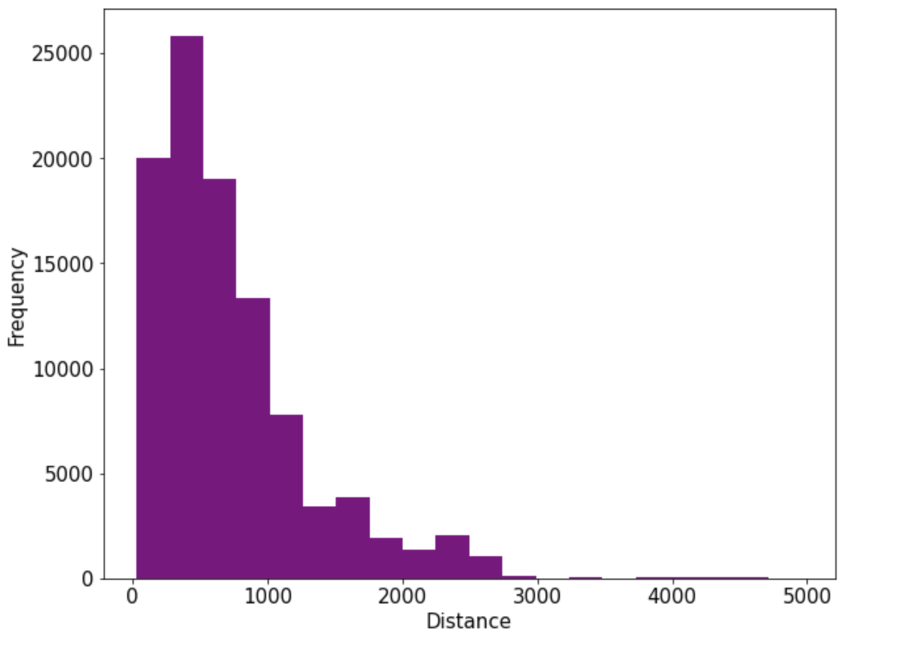
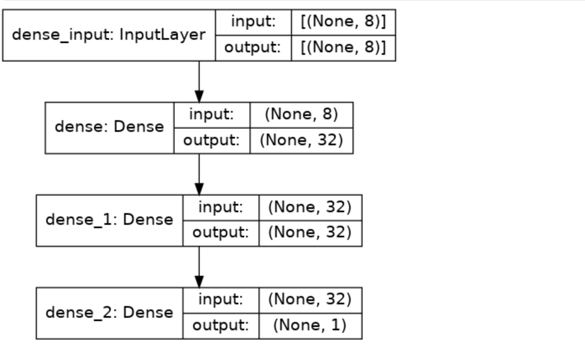

## **1. TensorFlow Modeling for Structured Data**

###  **1.1 Data Preparation**
```{python}
import os
import numpy as np
import pandas as pd
import datetime
import tensorflow as tf 
from tensorflow.keras import models, layers
from sklearn.metrics import roc_auc_score

import seaborn as sns
import matplotlib.pyplot as plt

INPUT_PATH = "../data/flight-delays/"
train = pd.read_csv(os.path.join(INPUT_PATH, "flight_delays_train.csv.zip"), compression='zip')
train.head()
```


```{python}
def preprocess(df):
    for col in ('Month', 'DayofMonth', 'DayOfWeek'):
        df[col] =  [int(x[2:]) for x in df[col]]      
        
    df['DepTime'] = df['DepTime'].apply(lambda x: float(x))
    df['DepHour'] = df['DepTime'] // 100
    df['Distance'] = df['Distance'].apply(lambda x: float(x))
    df.drop("DepTime", axis=1, inplace=True)
    
    for col in ['Origin', 'Dest', 'UniqueCarrier']:
        df[col] = pd.factorize(df[col])[0]
    
    return df

def preprocess_train(train):
    train = train.rename(columns={'dep_delayed_15min':'delayed'})
    train['delayed'] = train['delayed'].map({'Y': 1, 'N': 0})
    return train
    
train = preprocess(train)
train = preprocess_train(train)
 ```


```{python}
ax = train['delayed'].value_counts().plot(kind = 'bar',
     figsize = (10,8),fontsize=15, rot = 0)
ax.set_ylabel('Count',fontsize = 15)
ax.set_xlabel('delayed',fontsize = 15)
plt.show()
```


```{python}
%config InlineBackend.figure_format = 'png'
ax = train['Distance'].plot(kind = 'hist',bins = 20,color= 'purple',
                    figsize = (10,8),fontsize=15)

ax.set_ylabel('Frequency',fontsize = 15)
ax.set_xlabel('Distance',fontsize = 15)
plt.show()
```


```{python}
features = train.drop(["delayed"], axis=1)
labels = train["delayed"]

features, labels = features.to_numpy(), labels.to_numpy()
```
```
features.shape = (100_000, 8)
```

###  **1.2 Model Definition**
Most models are made of layers. Layers are functions with a known mathematical structure that can be reused and have trainable variables. <br>
Layers and models are build built on the same foundational class : `tf.Module`  <br>

```{python}
class SimpleModule(tf.Module):
    def __init__(self, name=None):
        super().__init__(name=name)
        self.a_variable = tf.Variable(5.0, name="train_me")
        self.non_trainable_variable = tf.Variable(5.0, trainable=False, name="do_not_train_me")
    def __call__(self, x):
        return self.a_variable * x + self.non_trainable_variable

simple_module = SimpleModule(name="simple")

simple_module(tf.constant(5.0))
```
```
<tf.Tensor: shape=(), dtype=float32, numpy=30.0>
```
In this chapter, we will use the Keras `Sequential()` API to build models. <br>
A Sequential model is appropriate for a plain stack of layers where each layer has exactly one input tensor and one output tensor.

```{python}
model = models.Sequential()
model.add(layers.Dense(32, activation = 'relu', input_shape=(features.shape[1],)))
model.add(layers.Dense(32, activation = 'relu'))
model.add(layers.Dense(1, activation = 'sigmoid'))

model.summary()
```
```
Model: "sequential"
_________________________________________________________________
Layer (type)                 Output Shape              Param #   
=================================================================
dense (Dense)                (None, 32)                288       
_________________________________________________________________
dense_1 (Dense)              (None, 32)                1056      
_________________________________________________________________
dense_2 (Dense)              (None, 1)                 33        
=================================================================
Total params: 1,377
Trainable params: 1,377
Non-trainable params: 0
_________________________________________________________________
```



###  **1.3 Model Training**

The simplist way to train a model using TensorFlow/Keras API is to call the internal function `fit()` method. <br>
Note that there two other ways to train models : train_on_batch or a customized training loop. <br>

```{python}
model.compile(optimizer='adam',
            loss='binary_crossentropy',
            metrics=['AUC'])

history = model.fit(features, labels,
                    batch_size=128,
                    epochs=30,
                    validation_split=0.2, # Use 20% of the training data for validation
                    shuffle=True,
                    callbacks = [tensorboard_callback]
                   )
 ```
 ```
Epoch 1/30
625/625 [==============================] - 2s 3ms/step - loss: 2.1507 - auc: 0.4914 - val_loss: 0.4973 - val_auc: 0.5742
Epoch 2/30
625/625 [==============================] - 1s 2ms/step - loss: 0.5352 - auc: 0.5572 - val_loss: 0.5218 - val_auc: 0.5760
Epoch 3/30
625/625 [==============================] - 1s 2ms/step - loss: 0.5318 - auc: 0.5715 - val_loss: 0.5322 - val_auc: 0.5824
Epoch 4/30
625/625 [==============================] - 1s 2ms/step - loss: 0.5199 - auc: 0.5817 - val_loss: 0.5203 - val_auc: 0.5956
Epoch 5/30
625/625 [==============================] - 1s 2ms/step - loss: 0.5141 - auc: 0.5974 - val_loss: 0.5990 - val_auc: 0.5759
Epoch 6/30
625/625 [==============================] - 1s 2ms/step - loss: 0.5150 - auc: 0.6002 - val_loss: 0.5392 - val_auc: 0.6364
Epoch 7/30
625/625 [==============================] - 1s 2ms/step - loss: 0.5181 - auc: 0.6060 - val_loss: 0.4930 - val_auc: 0.6573
Epoch 8/30
625/625 [==============================] - 1s 2ms/step - loss: 0.5030 - auc: 0.6129 - val_loss: 0.5011 - val_auc: 0.6272
Epoch 9/30
625/625 [==============================] - 1s 2ms/step - loss: 0.5045 - auc: 0.6124 - val_loss: 0.4822 - val_auc: 0.6772
Epoch 10/30
625/625 [==============================] - 1s 2ms/step - loss: 0.5119 - auc: 0.6126 - val_loss: 0.4777 - val_auc: 0.6682
Epoch 11/30
625/625 [==============================] - 1s 2ms/step - loss: 0.5005 - auc: 0.6165 - val_loss: 0.4676 - val_auc: 0.6626
Epoch 12/30
625/625 [==============================] - 1s 2ms/step - loss: 0.5016 - auc: 0.6204 - val_loss: 0.4640 - val_auc: 0.6694
Epoch 13/30
625/625 [==============================] - 1s 1ms/step - loss: 0.5003 - auc: 0.6243 - val_loss: 0.4682 - val_auc: 0.6641
Epoch 14/30
625/625 [==============================] - 1s 1ms/step - loss: 0.4958 - auc: 0.6261 - val_loss: 0.4957 - val_auc: 0.6458
Epoch 15/30
625/625 [==============================] - 1s 1ms/step - loss: 0.4990 - auc: 0.6266 - val_loss: 0.6043 - val_auc: 0.6409
Epoch 16/30
625/625 [==============================] - 1s 1ms/step - loss: 0.4933 - auc: 0.6269 - val_loss: 0.6328 - val_auc: 0.5897
Epoch 17/30
625/625 [==============================] - 1s 1ms/step - loss: 0.5065 - auc: 0.6216 - val_loss: 0.4602 - val_auc: 0.6789
Epoch 18/30
625/625 [==============================] - 1s 2ms/step - loss: 0.4973 - auc: 0.6345 - val_loss: 0.4646 - val_auc: 0.6819
Epoch 19/30
625/625 [==============================] - 1s 1ms/step - loss: 0.4962 - auc: 0.6295 - val_loss: 0.4603 - val_auc: 0.6821
Epoch 20/30
625/625 [==============================] - 1s 1ms/step - loss: 0.4951 - auc: 0.6303 - val_loss: 0.4630 - val_auc: 0.6761
Epoch 21/30
625/625 [==============================] - 1s 2ms/step - loss: 0.4811 - auc: 0.6400 - val_loss: 0.4693 - val_auc: 0.6675
Epoch 22/30
625/625 [==============================] - 1s 2ms/step - loss: 0.4856 - auc: 0.6382 - val_loss: 0.4605 - val_auc: 0.6787
Epoch 23/30
625/625 [==============================] - 1s 2ms/step - loss: 0.5019 - auc: 0.6287 - val_loss: 0.5616 - val_auc: 0.6636
Epoch 24/30
625/625 [==============================] - 1s 2ms/step - loss: 0.5051 - auc: 0.6233 - val_loss: 0.4633 - val_auc: 0.6849
Epoch 25/30
625/625 [==============================] - 1s 1ms/step - loss: 0.4787 - auc: 0.6493 - val_loss: 0.4650 - val_auc: 0.6771
Epoch 26/30
625/625 [==============================] - 1s 1ms/step - loss: 0.4911 - auc: 0.6366 - val_loss: 0.5034 - val_auc: 0.6490
Epoch 27/30
625/625 [==============================] - 1s 2ms/step - loss: 0.4838 - auc: 0.6416 - val_loss: 0.4885 - val_auc: 0.6502
Epoch 28/30
625/625 [==============================] - 1s 2ms/step - loss: 0.4802 - auc: 0.6469 - val_loss: 0.4862 - val_auc: 0.6514
Epoch 29/30
625/625 [==============================] - 1s 1ms/step - loss: 0.4743 - auc: 0.6508 - val_loss: 0.4627 - val_auc: 0.6771
Epoch 30/30
625/625 [==============================] - 1s 1ms/step - loss: 0.4759 - auc: 0.6485 - val_loss: 0.4662 - val_auc: 0.6760
```
